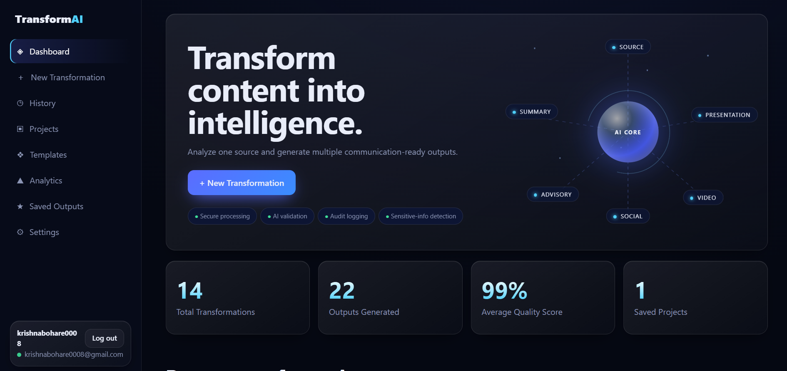
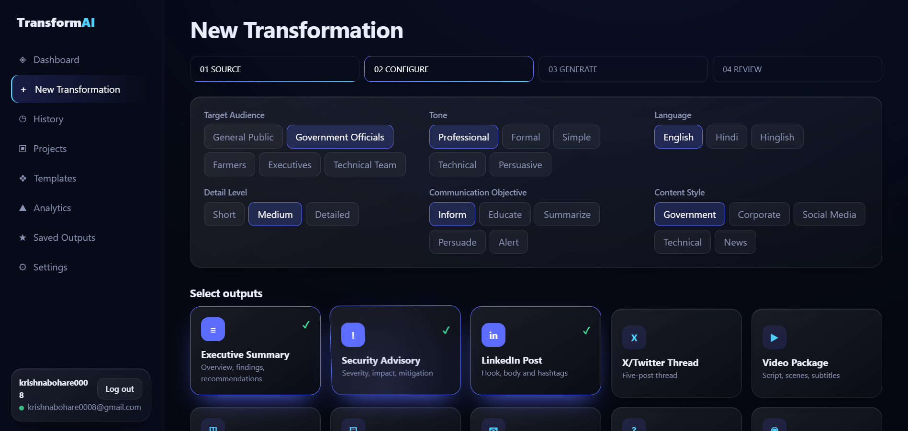
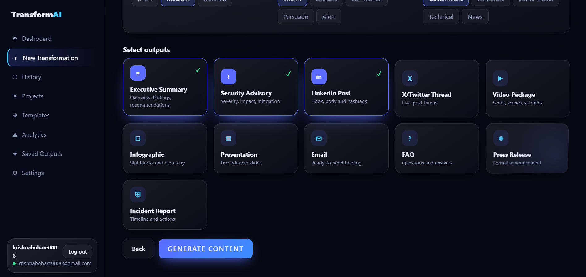
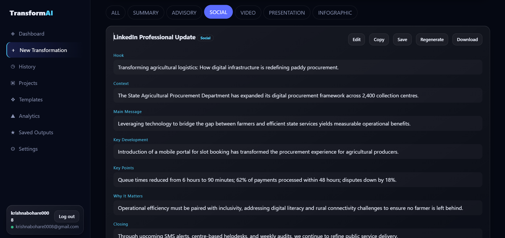
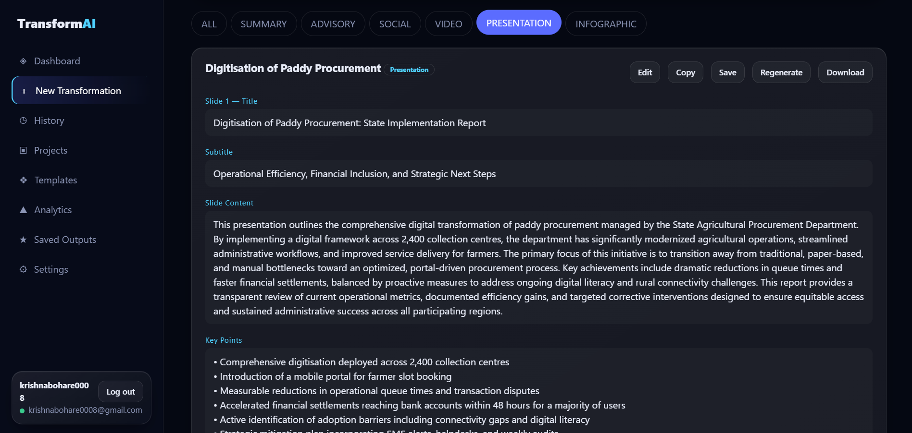
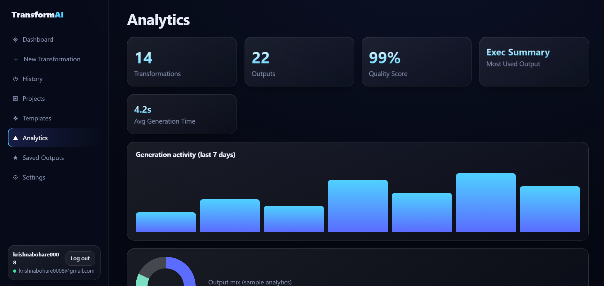
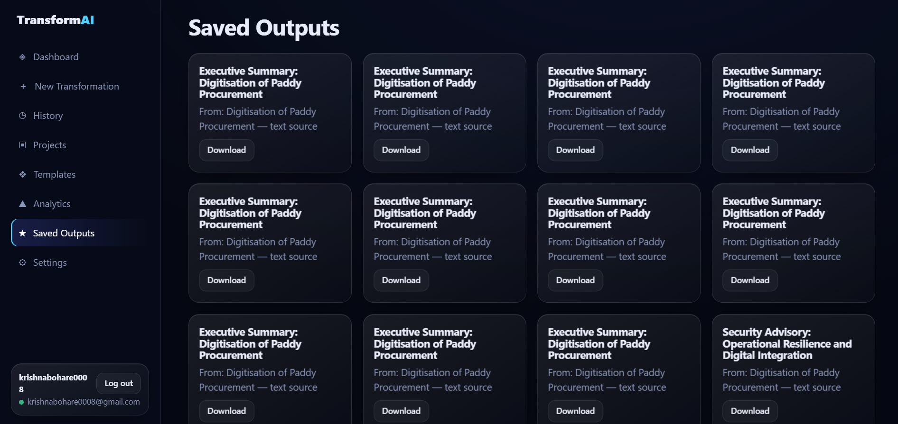

# TransformAI

### AI-Powered Multi-Format Content Transformation Platform

**TransformAI** is an AI-powered content transformation platform developed for **Smart India Hackathon 2026**.

The platform converts a common source of information into multiple communication-ready artefacts based on the operator's requirements.

Instead of manually analysing reports, articles, advisories, research papers, incident reports, announcements, or other information and recreating the same content for different communication channels, TransformAI allows the operator to provide the source once, configure the required parameters, and generate multiple structured outputs from a single dashboard.

---

## 🌐 Live Prototype

**TransformAI:**  
https://tranform-ai.vercel.app/

---

## 🎥 Demo Video

**Demo Video — Maximum Duration: 2 Minutes**

[Watch TransformAI Demo on YouTube](https://www.youtube.com/watch?v=9FmIN-giEEI)

---

# Problem Statement

Organisations frequently need to convert information available in different forms such as:

- News articles
- Reports
- Advisories
- Threat intelligence
- Policy documents
- Research papers
- Announcements
- Incident reports
- Free-form prompts
- Documents
- Images
- Videos
- Contextual information

into specific communication artefacts suitable for different purposes and audiences.

The manual process of:

- Analysing source content
- Understanding the communication objective
- Identifying the target audience
- Rewriting information
- Formatting content
- Preparing multiple communication artefacts

is time-consuming, resource-intensive, and often requires expertise in communication, content creation, and domain knowledge.

---

# Proposed Solution

TransformAI acts as an **AI-powered content transformation engine**.

The platform provides a configurable dashboard through which an operator can submit source information and define how the information should be transformed.

The operator can configure:

- Target audience
- Tone
- Language
- Level of detail
- Communication objective
- Content style
- Required output formats

The system then analyses the source information, understands its context and intent, and generates the selected communication artefacts.

Multiple output formats can be generated from the **same source content**.

---

# How TransformAI Works

```text
Source Information
        |
        v
Content Submission
        |
        v
Configuration
Audience • Tone • Language
Detail • Objective • Style
        |
        v
Output Selection
        |
        v
AI Content Analysis
        |
        v
Context & Intent Understanding
        |
        v
AI Transformation Engine
        |
        v
Selected Output Generation
        |
        v
Verification / Review
        |
        v
Edit • Copy • Save • Regenerate • Download
```

---

# Supported Output Formats

TransformAI can generate multiple communication artefacts including:

### Executive Summary

Generates a concise executive-level summary containing important findings, conclusions, and recommendations.

### Security Advisory

Generates structured security or operational advisories containing severity, impact, mitigation, and recommended actions.

### LinkedIn Post

Generates professional social-media content containing:

- Hook
- Context
- Main message
- Key developments
- Key points
- Closing

### X / Twitter Thread

Generates structured multi-post threads optimised for short-form communication.

### Video Package

Generates a complete video communication package including:

- Video title
- Objective
- Audience
- Duration
- Opening hook
- Full script
- Scene suggestions
- Narration
- Subtitle-ready content

### Presentation

Generates structured presentation content including:

- Slide titles
- Subtitles
- Slide content
- Key points
- Presentation structure

### Infographic

Generates:

- Key statistics
- Information hierarchy
- Key messages
- Layout recommendations

### Email

Generates structured professional email communication.

### FAQ

Generates questions and answers based on the supplied source information.

### Press Release

Generates structured formal announcement content.

### Incident Report

Generates structured incident reporting content including timelines, observations, and actions.

---

# Multi-Output Generation

One of the major capabilities of TransformAI is the ability to generate **multiple communication artefacts from the same source**.

For example:

```text
One Source Report
       |
       ├── Executive Summary
       ├── Security Advisory
       ├── LinkedIn Post
       ├── X Thread
       ├── Video Package
       ├── Presentation
       └── Infographic
```

This reduces repetitive manual work and ensures consistency across different communication formats.

---

# Configurable Generation Parameters

Operators can customise generation according to their communication requirement.

## Target Audience

Examples include:

- General Public
- Government Officials
- Farmers
- Executives
- Technical Teams

## Tone

Available communication styles can include:

- Professional
- Formal
- Simple
- Technical
- Persuasive

## Language

The platform supports configurable language selection such as:

- English
- Hindi
- Hinglish

## Detail Level

Users can control how detailed the generated content should be:

- Short
- Medium
- Detailed

## Communication Objective

The operator can define the objective of communication:

- Inform
- Educate
- Summarise
- Persuade
- Alert

## Content Style

Different communication styles can be selected depending on the use case:

- Government
- Corporate
- Social Media
- Technical
- News

---

# Core Features

- AI-powered source analysis
- Context-aware content understanding
- Intent-aware content generation
- Multi-format transformation
- Multiple outputs from one source
- Configurable target audience
- Configurable tone
- Language selection
- Configurable detail level
- Communication objective selection
- Content style selection
- Reusable templates
- Transformation history
- Project management
- Saved outputs
- Analytics dashboard
- Output quality reporting interface
- Edit generated content
- Copy generated output
- Regenerate output
- Save output
- Download generated content
- Responsive web-based dashboard

---

# System Architecture

```text
                    USER / OPERATOR
                          |
                          v
               +----------------------+
               |   TransformAI Web UI |
               |      index.html      |
               +----------+-----------+
                          |
                          v
               +----------------------+
               |   Serverless API     |
               |        Layer         |
               +----------------------+
                 |         |         |
                 v         v         v
             analyze.js generate.js verify.js
                 \         |         /
                  \        |        /
                   +-------+-------+
                           |
                           v
                  +-----------------+
                  |  AI Processing  |
                  |      Layer      |
                  +--------+--------+
                           |
                           v
               Context & Intent Analysis
                           |
                           v
                  Content Generation
                           |
                           v
                       Verification
                           |
                           v
                  Generated Artefact
                           |
                           v
               Review / Save / Download
```

---

# API Modules

## `api/analyze.js`

Responsible for analysing submitted source information and extracting relevant context required for transformation.

Key responsibilities include:

- Source interpretation
- Context analysis
- Information extraction
- Preparation of structured data for generation

---

## `api/generate.js`

Responsible for generating the selected communication artefacts.

Generation considers parameters such as:

- Target audience
- Tone
- Language
- Detail level
- Communication objective
- Content style
- Selected output format

---

## `api/verify.js`

Responsible for verification-related processing associated with generated content.

It supports the validation layer before presenting generated results to the operator.

---

# Technology Stack

## Frontend

- HTML5
- CSS3
- JavaScript
- Responsive Web Interface

## Backend

- JavaScript
- Serverless API Functions

## AI Layer

- Generative AI integration
- Prompt-based content analysis
- Context-aware generation
- Structured content generation
- Output verification

## Deployment

- GitHub
- Vercel

---

# Platform Modules

TransformAI includes several dashboard modules.

### Dashboard

Provides a high-level overview of platform activity and quick access to transformations.

### New Transformation

Allows operators to:

- Add source information
- Configure generation parameters
- Select one or multiple outputs
- Generate content

### History

Stores previous transformations and allows operators to revisit generated content.

### Projects

Allows related transformations to be organised into projects.

### Templates

Provides reusable configurations such as:

- Government Report
- Security Advisory
- Executive Brief
- Press Release
- Social Media Campaign
- Video Campaign

### Analytics

Provides an overview of:

- Transformations performed
- Outputs generated
- Quality score
- Average generation time
- Recent generation activity

### Saved Outputs

Stores generated communication artefacts for future access.

---

# Repository Structure

```text
tranform-ai/
│
├── api/
│   ├── analyze.js
│   ├── generate.js
│   └── verify.js
│
├── docs/
│   ├── Transform-AI-Technical-Presentation-FINAL.pdf
│   └── Transform_AI_Architecture_Professional_FINAL.pdf
│
├── screenshots/
│   ├── analytics.png
│   ├── dashboard.png
│   ├── linkedin-result.png
│   ├── new-transformation.png
│   ├── output-selection.png
│   ├── presentation-result.png
│   └── saved-outputs.png
│
├── index.html
└── README.md
```

---

# Application Screenshots

## Dashboard



The TransformAI dashboard provides an overview of platform activity and allows the operator to quickly start a new transformation.

---

## New Transformation



The transformation interface allows the operator to configure:

- Target audience
- Tone
- Language
- Detail level
- Communication objective
- Content style

before generating the final artefacts.

---

## Output Selection



The operator can select one or multiple output formats.

Available outputs include:

- Executive Summary
- Security Advisory
- LinkedIn Post
- X / Twitter Thread
- Video Package
- Infographic
- Presentation
- Email
- FAQ
- Press Release
- Incident Report

---

## Generated LinkedIn Output



TransformAI generates structured LinkedIn-ready communication containing the hook, context, main message, important developments, key points, and closing content.

---

## Generated Presentation



TransformAI generates presentation-ready content containing slide titles, subtitles, detailed slide content, and key points.

---

## Analytics Dashboard



The analytics interface provides visibility into transformation activity, generated outputs, quality metrics, and generation performance.

---

## Saved Outputs



Generated communication artefacts can be saved and accessed again through the Saved Outputs interface.

---

# Technical Documentation

## Architecture Document

The complete system architecture is available here:

[View TransformAI Architecture Document](docs/Transform_AI_Architecture_Professional_FINAL.pdf)

**Maximum Length:** 2 Pages

---

## Technical Presentation

The technical presentation is available here:

[View TransformAI Technical Presentation](docs/Transform-AI-Technical-Presentation-FINAL.pdf)

**Maximum Slides:** 5 Slides

---

# Setup Instructions

## 1. Clone the Repository

```bash
git clone https://github.com/kbohare95-droid/tranform-ai.git
```

---

## 2. Open the Repository

```bash
cd tranform-ai
```

---

## 3. Configure Required API Credentials

Configure the required AI and backend credentials through the deployment environment.

Private API keys should be stored as environment variables.

Never expose secret credentials directly inside frontend source code or commit private keys to GitHub.

---

## 4. Run / Deploy the Application

The project is currently deployed using Vercel.

To deploy your own instance:

1. Fork or clone the repository.
2. Sign in to Vercel.
3. Import the GitHub repository.
4. Configure the required environment variables.
5. Deploy the application.
6. Open the generated deployment URL.

---

# Security Considerations

TransformAI is designed with separation between the frontend and backend/serverless processing layer.

Recommended deployment practices include:

- Keep API keys in environment variables
- Do not expose secret API keys in frontend code
- Validate incoming requests
- Validate generated outputs
- Apply secure authentication where required
- Restrict access to sensitive information
- Maintain audit logging for production deployments

---

# Advantages

TransformAI provides several operational advantages:

- Reduces repetitive manual content creation
- Saves communication preparation time
- Generates multiple outputs from a single source
- Improves consistency across communication channels
- Provides configurable outputs for different audiences
- Reduces dependence on separate content-generation workflows
- Provides reusable templates
- Centralises transformation history
- Enables structured content generation
- Improves operational efficiency

---

# Potential Use Cases

TransformAI can be useful for:

- Government organisations
- Cybersecurity teams
- Public-sector organisations
- Corporate communication teams
- Research organisations
- Educational institutions
- Media teams
- Policy organisations
- Disaster management teams
- Intelligence and information-analysis teams
- Public relations departments

---

# Future Scope

Future versions of TransformAI can include:

- Advanced document understanding
- PDF understanding
- Image understanding
- Video understanding
- Speech-to-text processing
- Automatic video generation
- Automatic infographic generation
- Advanced multilingual generation
- Organisation-specific templates
- Collaborative workspaces
- Role-based access control
- Version management
- Advanced audit logs
- Enterprise integrations
- Direct social-media publishing
- Export to additional document formats
- Automated presentation generation
- Organisation-specific AI models and knowledge bases

---

# SIH 2026 Deliverables

| Deliverable | Status |
|---|---|
| Source Code | ✅ Available |
| README with Setup Instructions | ✅ Available |
| Architecture Document — Max 2 Pages | ✅ Available |
| Demo Video — Max 2 Minutes | ✅ Available |
| Technical Presentation — Max 5 Slides | ✅ Available |
| Live Prototype | ✅ Available |
| Application Screenshots | ✅ Available |

---

# Important Links

**Live Prototype**  
https://tranform-ai.vercel.app/

**Demo Video**  
https://www.youtube.com/watch?v=9FmIN-giEEI

**GitHub Repository**  
https://github.com/kbohare95-droid/tranform-ai

**Architecture Document**  
[Open Architecture Document](docs/Transform_AI_Architecture_Professional_FINAL.pdf)

**Technical Presentation**  
[Open Technical Presentation](docs/Transform-AI-Technical-Presentation-FINAL.pdf)

---

# Smart India Hackathon 2026

### TransformAI

**Team:** RISU TECH FALCONS

TransformAI aims to simplify organisational communication by transforming a common source of information into multiple purpose-specific communication artefacts through an intelligent, configurable, and AI-powered platform.
